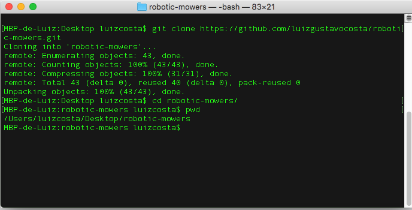
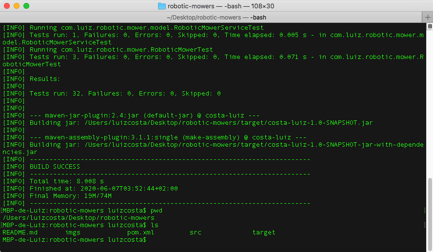
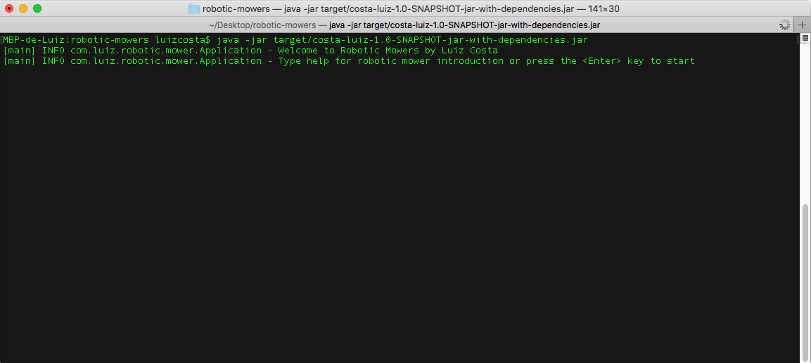
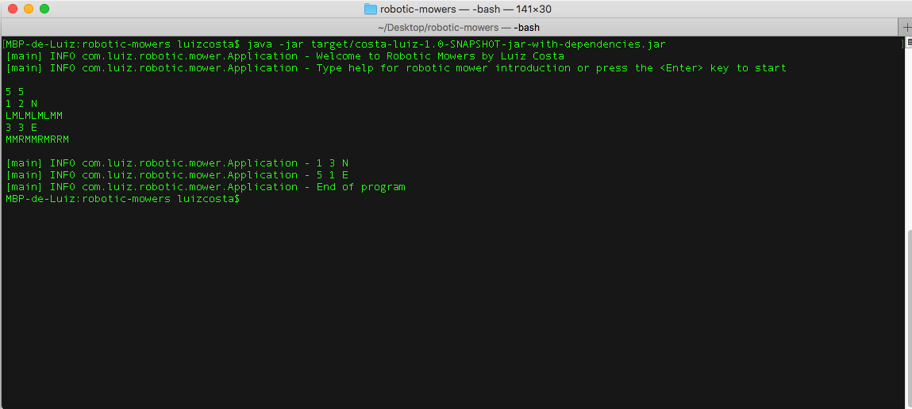
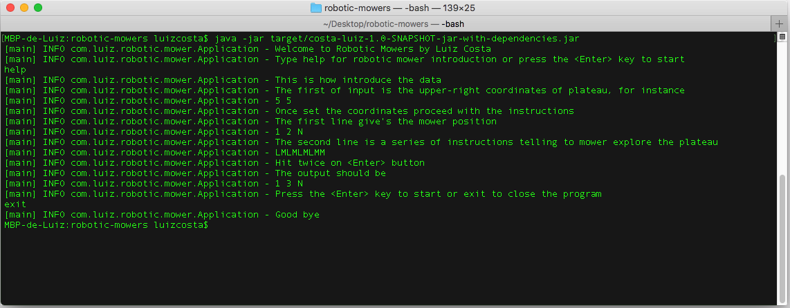

[](https://travis-ci.org/luizgustavocosta/robotic-mowers)

# Project title 
:robot: Robotic mowers project 

# Assumption
Required software .: Maven and Java 8+

Knowledge about the robotic mowers movements, i.e Left Right Move and so on. 

# Getting Started
  * How to compile?
  
    Through the git clone  command ``git clone https://github.com/luizgustavocosta/robotic-mowers.git``
     

     After the clone finish, type ```cd robotic-movers``` to go to the source root.

   * Generate the executable
   
     Inside you can execute the following command to ```mvn clean verify``` to generate the executable jar.

     

# How to run
  
  * Execute on your command the following .: ``java -jar target/costa-luiz-1.0-SNAPSHOT-jar-with-dependencies.jar `` and the program will start.
  
  
  
   Every time you run the program you can choose the help option to know how to execute or run it directly
   
# User interface

 * The user interface is build using the CLI, so pay attention for the correct use.
 
 * To start typing information regarding the upper-right coordinates of plateau, press the ENTER key
    
    
 * The help is available on every launch program, to use type help
    * After use the help option and won't go ahead type exit
    
    
    
# How the robot works?

This robot works into a plateau provides by user as the first line argument. This value should be filled only once by execution.

For the second step the initial coordinate also is provide by user, i.e x,y,direction (N, S, E, W)

For the third step the movements L,R,M, i.e left, right or move. In case the movements be out of bounds one exception will be thrown.

## Author
Luiz Gustavo Costa

## Acknowledgments

* Java 8
* Maven
* JUnit 5
